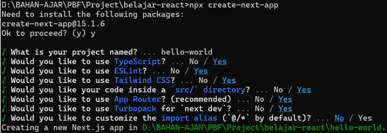

This is a [Next.js](https://nextjs.org/) project bootstrapped with [`create-next-app`](https://github.com/vercel/next.js/tree/canary/packages/create-next-app).

## Getting Started

First, run the development server:

```bash
npm run dev
# or
yarn dev
# or
pnpm dev
# or
bun dev
```

Open [http://localhost:3000](http://localhost:3000) with your browser to see the result.

You can start editing the page by modifying `app/page.tsx`. The page auto-updates as you edit the file.

This project uses [`next/font`](https://nextjs.org/docs/basic-features/font-optimization) to automatically optimize and load Inter, a custom Google Font.

## Laporan Praktikum

|  | Pemrograman Berbasis Framework 2025 |
|--|--|
| NIM |  2241720025|
| Nama |  Abiam Fadricho Syuhadak |
| Kelas | TI - 3A |


## Pertanyaan Praktikum 1

1. elaskan kegunaan masing-masing dari Git, VS Code dan NodeJS yang telah Anda install
pada sesi praktikum ini!
2. Buktikan dengan screenshoot yang menunjukkan bahwa masing-masing tools tersebut
telah berhasil terinstall di perangkat Anda!  

### Jawaban
1. Git digunakan untuk menyimpan dan melacak perubahan kode secara efisien.    
VS Code alat editor kode untuk menulis, mengedit, dan debbuging kode.   
Node Js Node.js adalah JavaScript runtime environment yang memungkinkan JavaScript berjalan di luar browser, sehingga bisa digunakan untuk membangun aplikasi backend/server.
2. 


# Praktikum 2
1. Membuat folder proyek baru dengan nama belajar-react. Melalui konsol/command
prompt/CMD masuk ke dalam folder tersebut dan jalankan perintah ini: npx create-next-app
2. Buat proyek baru dengan nama hello-world seperti di bawah ini. Nama proyek ini perlu
dimasukkan pertama kali melalui konsol.

3. Buka folder proyek hello-world menggunakan VS Code. Masuk ke dalam folder proyek helloworld dengan perintah: cd hello-world
4. Running proyek hello-world dengan memasukkan perintah di bawah ini melalui konsol atau
terminal di dalam VS Code.
-npm run dev


## Pertanyaan Praktikum 2
1. Pada Langkah ke-2, setelah membuat proyek baru menggunakan Next.js, terdapat beberapa
istilah yang muncul. Jelaskan istilah tersebut, TypeScript, ESLint, Tailwind CSS, App
Router, Import alias, App router, dan Turbopack!
2. Apa saja kegunaak folder dan file yang ada pada struktur proyek React yang tampil pada
gambar pada tahap percobaan ke-3!
3. Buktikan dengan screenshoot yang menunjukkan bahwa tahapan percobaan di atas telah
berhasil Anda lakukan!
## Jawaban!
1. - TypeScript adalah bahasan pemrograman berbasis JavaScript yang menambahkan fitur tipe statis. Fungsi dalam Next.js yaitu meningkatkan keamanan kodedengan mendeteksi error lebih awal dan membantu dalam autocomplete dan refactoring kode.
- ESLint adalah linter untuk JavaScript dan TypeScript yang membantu menemukan serta memebrikan kesalahan kode berdasarkan aturan yang ditemukan. Fungsinya yaitu memastikan konsistensi kode dengan aturan yang baku dan mendeteksi bug dan potensi kesalahan dalam kode.
- Tailwind CSS adalah framework CSS utility-first yang memungkinkan pengembang ntuk menulis desain langsung di dalem elemen HTML tanpa membuat anyak file CSS. Fungsinya mempercepat proses styling dengan class utility seperti p-4, text-center, bg-blue-500 dan menghasilkan desain yang konsisten tanpa perlu membuat file CSS tambahan.
- App Router adalah sistem routing baru di Next.js mulai versi 13 yang berbasis pada file dan folder di dalam direktori app/. Fungsinya Menggunakan React Server Components untuk meningkatkan performa dan mendukung fitur server-side rendering (SSR) dan static generation (SSG) secara otomatis.
- Import Alias memungkinkan kita untuk menggunakan path pendek dalam mengimpor file, sehingga lebih rapi dan mudah dikelola. Fungsinya Menghindari import path yang panjang dan berantakan dan memudahkan navigasi antar file dalam proyek besar.
- Turbopack adalah bundler baru yang dikembangkan oleh Vercel untuk menggantikan Webpack di Next.js. Fungsinya 40 kali lebih cepat dibandingkan Webpack dalam mode pengembangan dan memanfaatkan incremental bundling, sehingga hanya file yang berubah yang akan diproses ulang.
2.    - .next adalah sebuah folder yang digunakan untuk menyimpan file-file yang dihasilkan oleh proses build aplikasi React.
    - node_modules adalah sebuah folder yang digunakan untuk menyimpan semua modul yang dibutuhkan oleh aplikasi React.
    - public adalah sebuah folder yang digunakan untuk menyimpan semua file-file yang dibutuhkan oleh aplikasi React.
    - src adalah sebuah folder yang digunakan untuk menyimpan semua file-file yang dibutuhkan oleh aplikasi React.
    - .gitignore adalah sebuah file yang digunakan untuk menentukan file-file yang tidak perlu di-commit ke dalam repositori.
    - eslint.config.js adalah sebuah file yang digunakan untuk menentukan standar linting untuk aplikasi React.
    - next-env.d.ts adalah sebuah file yang digunakan untuk menentukan tipe data yang dibutuhkan oleh aplikasi React.
    - next.config.js adalah sebuah file yang digunakan untuk menentukan konfigurasi aplikasi React.
    - package-lock.json adalah sebuah file yang digunakan untuk menentukan versi modul yang digunakan oleh aplikasi React.
    - package.json adalah sebuah file yang digunakan untuk menentukan informasi tentang aplikasi React.
    - postcss.config.js adalah sebuah file yang digunakan untuk menentukan konfigurasi PostCSS.
    - tailwind.config.js adalah sebuah file yang digunakan untuk menentukan konfigurasi Tailwind CSS.
    - tsconfig.json adalah sebuah file yang digunakan untuk menentukan tipe data dan konfigurasi TypeScript.

# Praktikum 3
1. Di dalam folder proyek yang telah dibuka di VS Code, buka file page.tsx
2. Tambahkan fungsi MyButton yang mengembalikan markup komponen button yang akan
ditambahkan ke dalam webpage 


# Praktikum 4
1. Tambahkan kode JSX di bawah ini ke dalam file page.tsx.


## Pertanyaan Praktikum 4
1. Untuk apakah kegunaan sintaks user.imageUrl?
- Digunakan untuk menampilkan foto profil atau avatar pengguna dalam aplikasi.